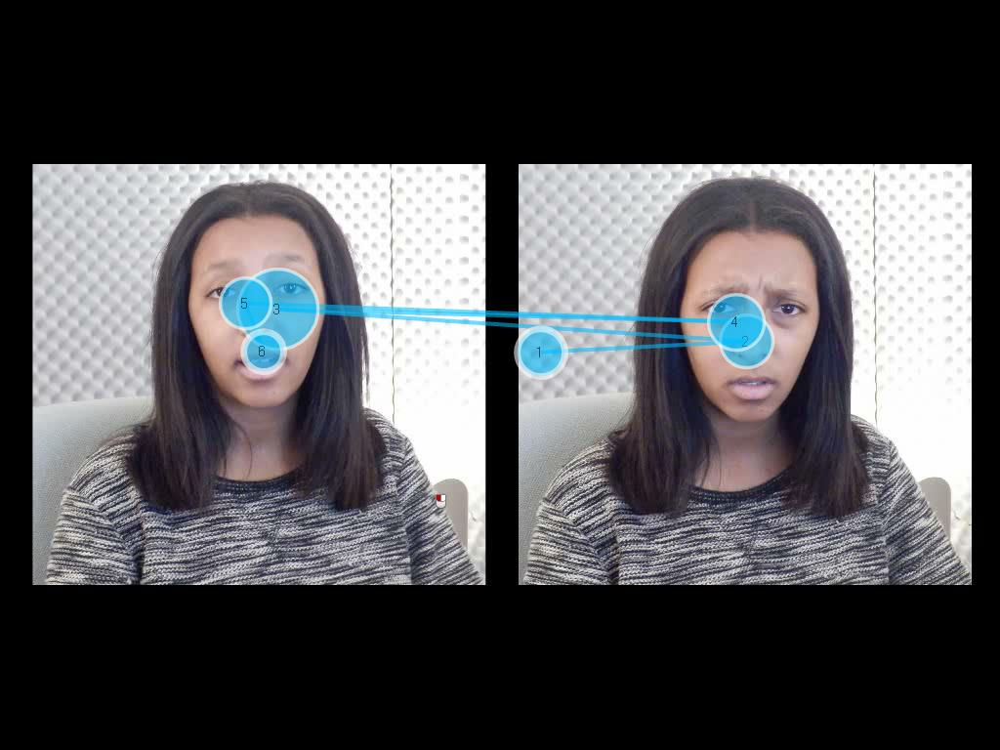
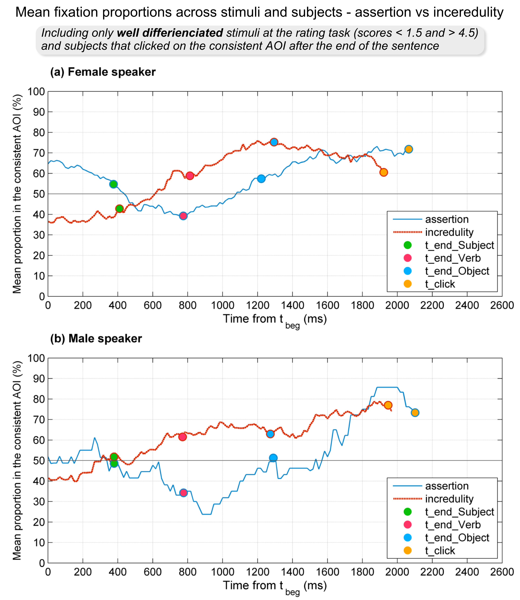

## tobii_emoz

Functions to process Tobii's eye-tracking data recording during a task of emotion recognition from speaker intonation. The experiment is very specific to the study. You can find details about the study in this paper from Speech Prosody 2016 Proceedings : [Effects of prosody in processing speaker commitment in French, C. Petrone, A. Lonobile, C. Zielinski and K. Ito](https://sites.google.com/site/sp2016enhancedproceedings/p524a).

### Experimental design (visual world paradigm) 
For each stimulus, a sentence is pronounced by a speaker (e.g. "Mary organized a party."). At the same time, an image showing 2 different facial expressions of the speaker is showing. The instruction is to click on the picture representing the speaker. The possible pairs of face photographies are related to the expression of assertion/incredulity, anger/fear or sadness/happiness. The whole experiment contains a total of 126 stimuli that were built from 2 speakers (a woman and a man). The eye movements are recorded during the task using Tobii T120 with TobiiStudio.

Stimuli consist of video that display a fixed image and the sound of the speaker. The video (called media in TobiiStudio) have been named after the experimental condition that its represents. For example, for the sentence with intonation related to incredulity / woman case / and related face expression at the right of the screen : female42-incr-right.avi. These informations from the file name will be extracted during the data processing and used to know the name of the experimental condition and the location of the target AOI.

  

### Tobii data extraction
Prior to extract raw data in tsv file per participant (Export function of TobiiStudio), the AOI have been defined for each visual stimulus, so that extracted files contain the additional columns of fixation hits values per AOI  (for each row - e.g. measurement per 8 ms - the hit value is NaN if the related AOI is not shown at the screen yet, 0 if AOI is activate (displayed) but not fixated and 1 if AOI is activate and fixated).
The name of the AOI are formatted so that it begins with the "Cor" or "Incor" indication (AOI linked to the Correct answer vs AOI linked to the Incorrrect answer).

### Data processing with specific Matlab scripts
  
- emoz_time_analysis : main script to launch all the calculations:
	- emoz_timeanalysis_extract : function to read all the fixation data as well as additional data files (from the norming study and from the frequency analysis of the sentences). All the data are gather together in a BIG data structure with several versions of fixation data depending on the critical time used to make the temporal realignment per media. Additional functions are called to read the additional data: emoz_read_norming, emoz_red_critime and emoz_read_speechfreq
	- emoz_timeanalysis_prepare : reassign fixation values at common time samples (find fixations close to each "perfect time" point, the same for all media and conditions) (fsamlp = 60 Hz)
	- emoz_timeanalysis_compute : compute the mean proportion of fixation for all data type (fixations related to MAN/WOMAN speaker, correct/incorrect answers, poorly/well differenciated media)
	- emoz_timeanalysis_patchwork : define the composite curve of mean proportion of fixation using mean critical times to fix the limits of each portion of realigned data (from t_beg to t_noun, t_noun to t_verb...)
	- emoz_timeanalysis_patchwork_fig : output the figure of the fixation curves
	- emoz_timeanalysis_paper_fig : special figure for paper, with light title and the possibility to move the legend by hand before the figure being automatically saved
- emoz_timeanalysis_tabfull : write the processed fixation data in a table for statistical analysis

Tobii data that are provided in data/export_tobii directory are only a few sample of the whole data set (3 subjects/22).

  

Example of figure of result.

### More details and comments will coming soon and can be provided by request !

Data struture output by emoz_timeanalysis_extract

Sdat.[INTONATION_MEANING].[SPEAKER]
.subj : cell array of subject names
.medianames : cell array of media names
.corclick : matrix of flags [ Nmed x Nsubj ] with 1 for correct answer (click on the correct AOI) or 0 for incorrect answer
.norming: array holding the mean rating scores per media [Nmed x 1]
.freq: structure with the frequency characteristics of the sentence per media, with field t1, t2, slope and time

.datalign : substructure containing the fixation data per AOI with field:
		.[ALIGN_TIME] : 
time
isfix: contains the temporal fixation hit values (1 if Correct AOI is fixed, 0 otherwise), store in a cellule of dimension [Nmed x Nsubj].

tclick matrix with reaction times (mouse click on the AOI) [Nmed x Nsubj ]

tcrit: structure with field tbeg, tnoun, tverb, tend, each holding critical time vector per media in seconds [Nmed x 1].

22 participants

